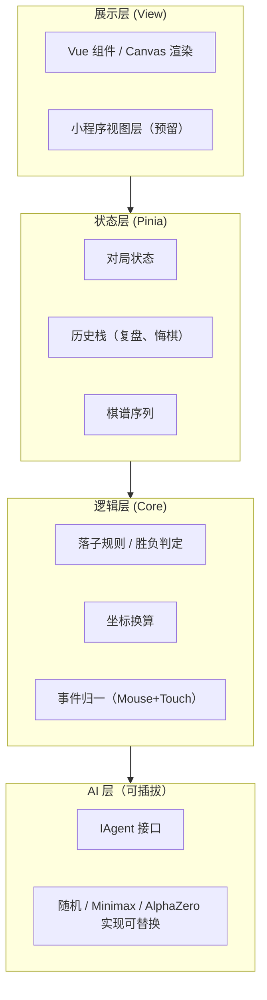

# 技术架构设计 (Technical Architecture)

## 文档信息

- **项目**：zen-gomoku
- **最后更新**：2026-03-02

---

## 1. 架构总览



- **展示层** 只负责绘制与输入，不持有业务状态。
- **状态层** 使用 Pinia，单一 store（如 `useGameStore`），状态含：棋盘二维数组、当前玩家、历史步数列表（用于复盘/悔棋）。
- **逻辑层** 纯函数或 composable，不依赖 DOM，便于在 Node / 小程序逻辑层复用。
- **AI 层** 通过接口注入，默认实现可替换为 Minimax 或后续 AlphaZero 风格实现。

### 1.1 源码目录建议

| 目录            | 职责                                             |
| --------------- | ------------------------------------------------ |
| `src/core/`     | 棋盘状态与规则、胜负判定、坐标换算（不依赖 DOM） |
| `src/renderer/` | Canvas 绘制、坐标映射                            |
| `src/stores/`   | Pinia store（如 `useGameStore`）                 |
| `src/ai/`       | IAgent 实现（RandomAgent、MinimaxAgent 等）      |

---

## 2. Canvas 渲染层多端适配

### 2.1 目标

- 同一套绘制与坐标换算逻辑，在 PC、Mobile H5、微信内置浏览器中一致表现。
- 交互统一为「物理坐标 → 棋盘 (row, col)」，由上层根据环境绑定 Mouse 或 Touch。

### 2.2 设计要点

| 要点     | 方案                                                                                                                                  |
| -------- | ------------------------------------------------------------------------------------------------------------------------------------- |
| 绘制 API | 使用 Canvas 2D（不依赖 DOM 尺寸单位），以「逻辑尺寸」计算格线/棋子位置，再乘以 scale 得到像素坐标                                     |
| 缩放     | `scale = min(containerWidth, containerHeight) / 15`，保证 15×15 格子落在容器内                                                        |
| 坐标换算 | 点击/触摸坐标 → 减去偏移、除以 scale → 得到逻辑坐标 → 四舍五入到最近交点，再转为 (row, col)                                           |
| 事件     | 在容器上统一监听 `pointerdown`（Mouse 与 Touch 均会触发），或分别 `mousedown` + `touchstart` 内调用同一套「物理坐标 → (row,col)」逻辑 |

### 2.3 文件与职责建议

- `renderer/BoardRenderer.ts`：接收 canvas 与容器尺寸，暴露 `drawBoard()`、`drawPiece(row, col, color)`、`clear()`。
- `renderer/coordMapper.ts`：`pixelToLogical(x, y)`、`logicalToPixel(row, col)`，依赖容器与 scale。
- 视图层不持有「当前棋盘状态」，由 Pinia 提供；渲染层只做「根据当前状态重绘」。

---

## 3. 游戏状态管理（Pinia）与复盘/悔棋

### 3.1 状态结构建议

```ts
// 示例结构
interface GameState {
  board: number[][] // 0 空 1 黑 2 白
  currentPlayer: 1 | 2
  history: { row: number; col: number; player: number }[] // 用于复盘、悔棋
  status: 'playing' | 'black_win' | 'white_win' | 'draw'
}
```

- **落子**：在 `history` 末尾 push 一步，并更新 `board`、`currentPlayer`、必要时 `status`。落子前由 Core 校验（空位、当前玩家）；非法落子不写入 `history`，通过返回值或事件通知 View 提示。
- **悔棋**：从 `history` pop 一步，恢复 `board` 与 `currentPlayer`。建议约定「仅允许撤销己方上一步」或明确双方可撤销步数，保证 `board` 与 `history` 一致。
- **复盘**：不修改 `history`，仅用「当前回放索引」在 UI 上高亮到某一步；播放时按索引取 `history` 前 N 步重绘。

### 3.2 与视图的配合

- 渲染层通过 `storeToRefs` 或计算属性订阅 `board`、`history.length` 等，状态变化后触发重绘。
- 复盘模式下，可用 `displayHistoryIndex`（0 到 history.length），渲染时只绘制 `history.slice(0, displayHistoryIndex)` 的棋子。

---

## 4. AI 模块可扩展设计

### 4.1 接口统一

- 定义 `IAgent` 接口：`getNextMove(board: number[][]): Promise<{ row: number; col: number } | null>`（null 表示认输或无法落子）。
- 人类玩家视为「由用户输入驱动的 Agent」，不实现该接口；AI 对战时代理白方或黑方调用不同 Agent 实现。

### 4.2 分阶段实现

| 阶段    | 实现类/文件                      | 说明                                                 |
| ------- | -------------------------------- | ---------------------------------------------------- |
| Phase 1 | `ai/RandomAgent.ts` 或规则 Agent | 随机空位或简单评分                                   |
| Phase 2 | `ai/MinimaxAgent.ts`             | Minimax + Alpha-Beta，可配置深度/耗时                |
| Phase 3 | `ai/AlphaZeroAgent.ts`（预留）   | 输入棋盘，输出落子或 pass；内部可调用本地模型或 HTTP |

### 4.3 与状态层协作

- 落子流程：状态层收到「请求落子」→ 调用当前 Agent 的 `getNextMove(currentBoard)` → 将返回的 `(row, col)` 作为一步写入 `history` 并更新 `board`。
- 不把 AI 状态（如搜索树）放进 Pinia，仅把「当前 Agent 实例」或类型标识存入 store，便于切换难度或机型。

---

## 5. 小程序/小游戏预留

- **逻辑层**：将「棋盘状态 + 落子逻辑 + 胜负判定」放在独立模块（如 `core/board.ts`、`core/engine.ts`），不依赖 `document`/`window`，可在小程序逻辑层直接引用。
- **视图层**：通过适配层调用小程序 setData 或 Canvas 2D API，事件由逻辑层统一处理（点击 → 坐标换算 → 落子命令）。
- **存储与网络**：棋谱保存/加载通过适配层抽象为「读/写键值」，在 Web 为 localStorage 或后端 API，在小程序为本地存储或云开发。
