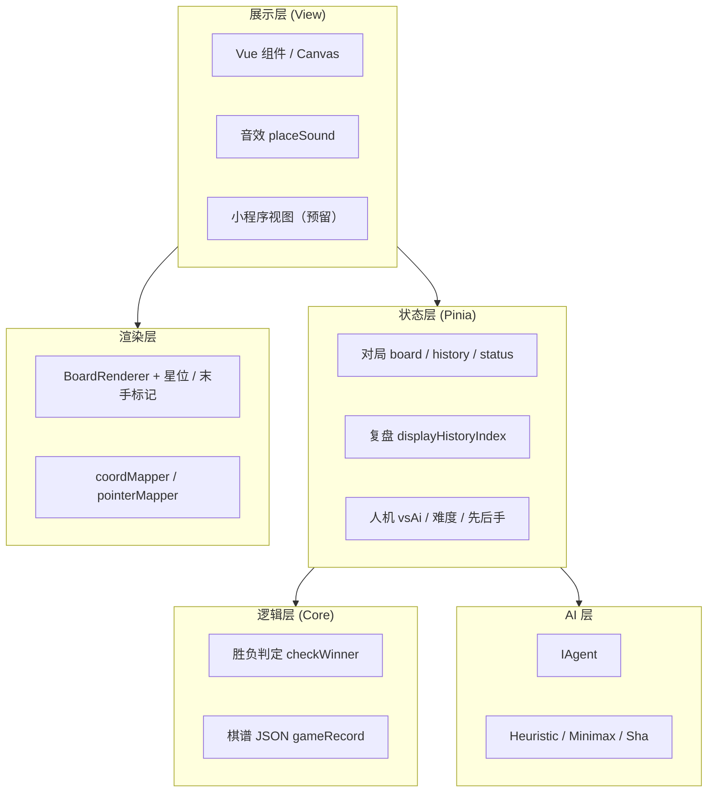

# 技术架构设计 (Technical Architecture)

## 文档信息

- **项目**：zen-gomoku
- **最后更新**：2026-08-04
- **配套**：功能规格 [functional-spec.md](../requirements/functional-spec.md)；AI [ai-agents.md](./ai-agents.md)

---

## 1. 架构总览


```mermaid
flowchart TB
    subgraph View["展示层 (View)"]
        V1["Vue 组件 / Canvas"]
        V2["音效 placeSound"]
        V3["小程序视图（预留）"]
    end

    subgraph Pinia["状态层 (Pinia)"]
        P1["对局 board / history / status"]
        P2["复盘 displayHistoryIndex"]
        P3["人机 vsAi / 难度 / 先后手"]
    end

    subgraph Core["逻辑层 (Core)"]
        C1["胜负判定 checkWinner"]
        C2["棋谱 JSON gameRecord"]
    end

    subgraph Renderer["渲染层"]
        R1["BoardRenderer + 星位 / 末手标记"]
        R2["coordMapper / pointerMapper"]
    end

    subgraph AI["AI 层"]
        A1["IAgent"]
        A2["Heuristic / Minimax / Sha"]
    end

    View --> Pinia
    View --> Renderer
    Pinia --> Core
    Pinia --> AI
```

- **展示层**：绘制与输入、落子音效/动效；不持有业务权威状态。
- **状态层**：`useGameStore` 单一真相来源。
- **逻辑层**：纯函数，可在 Node / 小程序逻辑层复用。
- **AI 层**：`IAgent` 注入；难度映射见 [ai-agents.md](./ai-agents.md)。

### 1.1 源码目录（现状）

| 目录                   | 职责                                                   |
| ---------------------- | ------------------------------------------------------ |
| `src/core/`            | 胜负判定、棋谱序列化 / 重建                            |
| `src/renderer/`        | Canvas 棋盘、星位、棋子、末手标记、坐标 / pointer 映射 |
| `src/stores/`          | `useGameStore`（对局、复盘、人机、天元开局）           |
| `src/ai/`              | `IAgent`、启发、Minimax、四级难度工厂                  |
| `src/audio/`           | 落子音效与静音偏好                                     |
| `src/storage/`         | localStorage / 文件读写适配                            |
| `src/components/game/` | 棋盘、模式栏、棋谱栏、复盘栏                           |
| `src/hooks/`           | `useBoardPointer` 等                                   |

---

## 2. Canvas 渲染层

### 2.1 目标

- PC / Mobile H5 / 微信内一致：物理坐标 → `(row, col)`。
- 正方形棋盘容器 + `devicePixelRatio`，避免非等比拉伸。

### 2.2 设计要点

| 要点 | 方案                                                           |
| ---- | -------------------------------------------------------------- |
| 绘制 | Canvas 2D；格线 → **五星** → 棋子 → 末手红圈                   |
| 缩放 | `scale = min(w, h) / 15`；外层 CSS `--board-size`              |
| 坐标 | offset 半格内收；`pointerEventToLogical`                       |
| 事件 | `pointerdown` + `touch-action: none`                           |
| 反馈 | 末手标记；落子短缩放由 View 驱动 `drawPiece(..., radiusScale)` |

### 2.3 文件

- `BoardRenderer.ts`：`drawBoard`（含 `STAR_POINTS`）、`drawPiece` / `drawPieces`、`drawLastMoveMark`
- `coordMapper.ts` / `pointerMapper.ts`

---

## 3. 游戏状态（Pinia）与复盘

### 3.1 状态（要点）

```ts
// 概念结构（非完整类型）
{
  board: number[][]           // 0 空 1 黑 2 白
  currentPlayer: 1 | 2
  history: { row, col, player }[]
  status: 'playing' | 'black_win' | 'white_win' | 'draw'
  displayHistoryIndex: number // 复盘：绘制 history 前 N 步
  vsAi: boolean
  humanFirst: boolean         // true 人执黑；false AI 执黑
  aiDifficulty: 'sha' | 'zhu' | 'wukong' | 'tang'
  aiThinking: boolean
}
```

- **天元开局**：`history.length === 0` 时仅允许 `(7, 7)`。
- **人机**：`aiPlayer = humanFirst ? 2 : 1`；轮到 AI 时调度 `agent.getNextMove` 再 `placeStone`。
- **先后手切换**：清空对局并按新设置开局（含 AI 先时自动下天元）。
- **复盘**：不改 `history`；非 live 边沿时 `canPlay === false`。
- **悔棋**：`undoMove()`；人人每次 pop 1 手；人机末手为 AI 时 pop「人+AI」2 手（仅 AI 开局一手则 pop 1）；取消进行中的 AI；终局可悔回 `playing`；复盘浏览中不可悔（须先回最新局面）。

### 3.2 棋谱

- 格式：项目 JSON（`gameRecord`）；非 SGF。
- 适配：`storage` 键值 + 文件下载/选择导入；终局可自动写入 localStorage。

---

## 4. AI 模块

> 算法、四级参数与文件表见 **[ai-agents.md](./ai-agents.md)**。

### 4.1 接口

```ts
interface IAgent {
  readonly name: string
  getNextMove(board: number[][]): Promise<{ row: number; col: number } | null>
}
```

### 4.2 阶段

| 阶段    | 实现                                  | 状态   |
| ------- | ------------------------------------- | ------ |
| Phase 1 | `HeuristicAgent` / `RandomAgent`      | 已实现 |
| Phase 2 | `MinimaxAgent` + `difficulty.ts` 四级 | 已实现 |
| Phase 3 | `AlphaZeroAgent`                      | 预留   |

### 4.3 与 Store

- Store 持有 Agent 实例与 `aiDifficulty`；搜索树不进 Pinia。
- 切换难度：`createAgentForDifficulty`，影响后续 AI 手。

---

## 5. 音效与体验

- `src/audio/placeSound.ts`：懒加载音频；`localStorage` 静音键。
- 素材与许可：`src/assets/audio/README.md`。
- 布局：模式栏 / 记录提示 / 复盘条固定占位，减轻棋盘跳动。

---

## 6. 小程序/小游戏预留

- **逻辑层**：`core/`、`ai/` 保持无 DOM。
- **视图 / 存储**：需适配层；当前仅 Web。

---

## 修订记录

| 日期       | 说明                                       |
| ---------- | ------------------------------------------ |
| 2026-03-02 | 初稿                                       |
| 2026-08-04 | 同步目录、天元/人机/星位/音效等现状（#49） |
